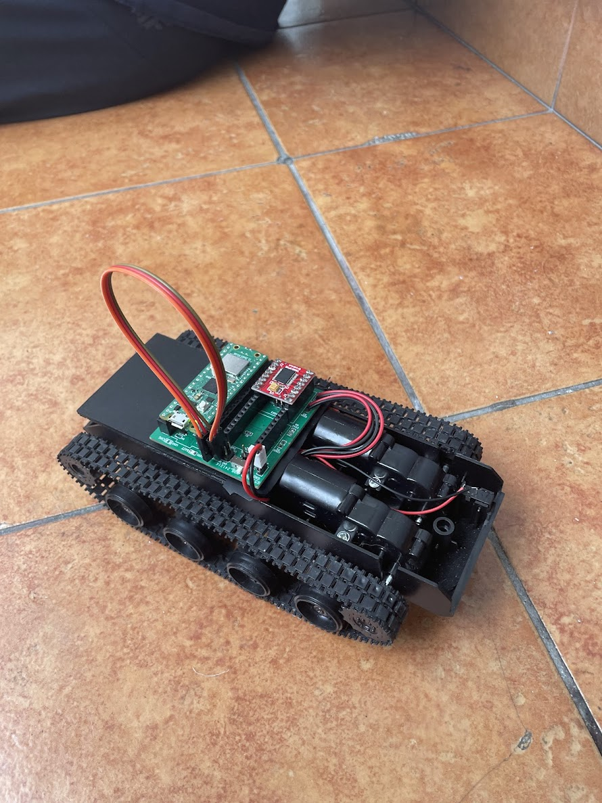
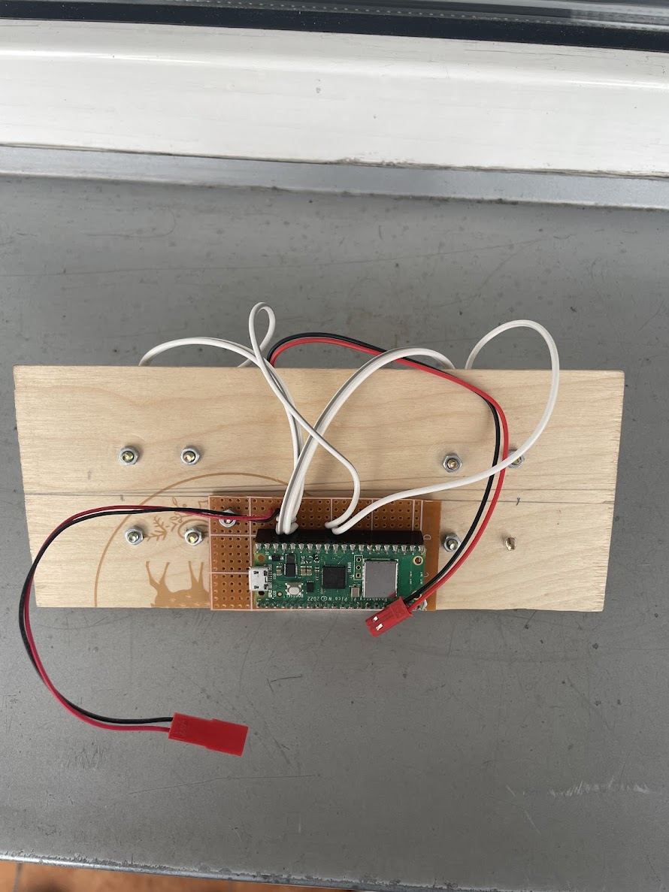
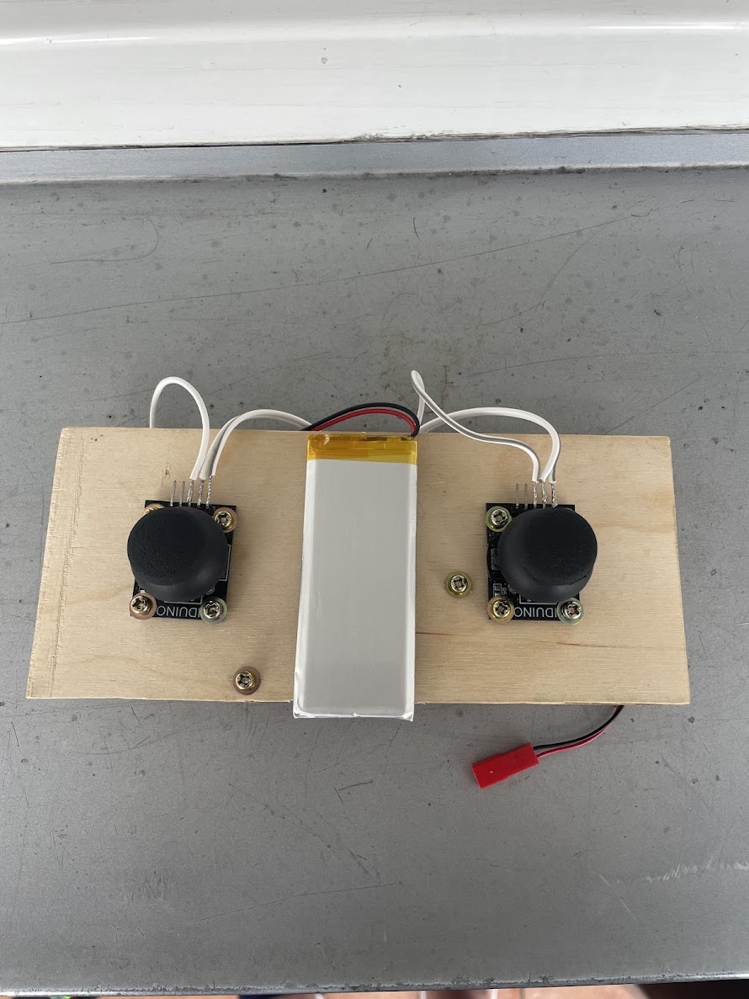

# SYTEMY WBUDOWANE 2025
## Stanisław Barycki, Piotr Błaszczyk, Krzysztof Swędzioł

## // TODO WSTEPNY OPIS ITP

## CZOŁG
### //TODO, opis czołgu, jaka beteria elemnety itp



## kod main.py czołgu

```python
from machine import Pin
from motor import Motor
import time
from command_handler import command_handler, AuthenticationError, UnknownCommandError, InvalidArgumentsError, CommandError
from wifi_receiver_ap import setup

SSID = "PICO_AP_2"
PASSWORD = "secret_password_123"
PORT = 4343
IP = "192.168.4.1"
BUF_SIZE = 1024

M0_IN1_PIN = 13
M0_IN2_PIN = 14
M0_PWM = 15
M1_IN1_PIN = 12
M1_IN2_PIN = 11
M1_PWM = 10

last_command_time = 0
SAFE_TIMEOUT = 2.0

def watchdog_task(motor_l, motor_r, last_command_time, timeout = SAFE_TIMEOUT):
    now = time.ticks_ms()
    elapsed = time.ticks_diff(now, last_command_time) / 1000.0
    print(f"Watchdog last command: {last_command_time} now: {now} elapsed: {elapsed}")
        
    if elapsed > timeout:
        print(f"!! Watchdog: Brak komendy od {elapsed:.1f}s – zatrzymuję pojazd !!")
        motor_l.disable()
        motor_r.disable()
        last_command_time = now
        return True
    return False

def led_blink(led: Pin, times: int, delta=0.2):
    for _ in range(times):
        led.toggle()
        time.sleep(delta)
        led.toggle()
        time.sleep(delta)
    led.on()

def main():
    led = Pin("LED", Pin.OUT)
    led.off()

    motor_l = Motor(M0_PWM, M0_IN1_PIN, M0_IN2_PIN)
    motor_r = Motor(M1_PWM, M1_IN1_PIN, M1_IN2_PIN)

    ap, server = setup(SSID, PASSWORD, PORT)
    led.on()


    try:
        while True:
            #Changed
            motor_l.disable()
            motor_r.disable()

            print("Czekam na klienta...")
            client_sock, client_addr = server.accept()
            client_sock.settimeout(2)
            print("==> Połączono z:", client_addr)
            led_blink(led, 4)

            recv_buffer = b""
            last_command_time = time.ticks_ms()
            try:
                while True:
                    
                    watchdog_task(motor_l, motor_r, last_command_time)
                        
                    try:
                        data = client_sock.recv(BUF_SIZE)
                    except OSError:
                        continue

                    if not data:
                        print("==> Klient się rozłączył")
                        break

                    recv_buffer += data
                    if b'\n' in recv_buffer:
                        print(recv_buffer)
                        line, *recv_buffer = recv_buffer.split(b'\n')
                        if recv_buffer[-1]:
                            line = recv_buffer[-1]
                        line = line.strip()
                        if not line:
                            continue
                        print("==> Odebrano:", line.decode())
                        try:
                            command_line = line.decode()
                            command_handler(command_line, motor_l, motor_r)
                            last_command_time = time.ticks_ms()
                        except (AuthenticationError, UnknownCommandError, InvalidArgumentsError, CommandError) as e:
                            print(f"==> Command handler error {e}")
                        recv_buffer =b""
                    

            except OSError as e:
                print("Błąd podczas komunikacji z klientem:", e)

            finally:
                client_sock.close()
                #Changed
                motor_l.disable()
                motor_r.disable()
                print("Gniazdo klienta zamknięte.\n")

    except KeyboardInterrupt:
        print("\nPrzerwano przez użytkownika (KeyboardInterrupt). Kończę…")

    except Exception as e:
        print("Nieoczekiwany błąd:", e)

    finally:	 
        #Changed
        motor_l.disable()
        motor_r.disable()
        try:
            led.off()
            server.close()
            print("Serwer zamknięty.")
        except:
            pass
        try:
            ap.active(False)
            print("Interfejs AP wyłączony.")
        except:
            pass
        print("Gotowe. Do zobaczenia!")

if __name__ == "__main__":
    main()
```


## JOYSTICK




### // TODO napiszcie tu coś, detale techiczne itp

### kod main.py joysticka

```python
import network
import socket
import time
from machine import ADC, Pin

import network, machine, gc, time
from machine import disable_irq, enable_irq

try:
    import rp2
    HAVE_RP2 = True
except ImportError:
    HAVE_RP2 = False

# ——— KONFIG ———
SSID             = 'PICO_AP_2'
PASSWORD         = 'secret_password_123'
HOST             = '192.168.4.1'
PORT             = 4343
AUTHORIZED_TOKEN = "very_secret_key_ilusion_of_safety"


def led_blink(led: Pin, times: int, delta=0.2):
    for _ in range(times):
        led.toggle()
        time.sleep(delta)
        led.toggle()
        time.sleep(delta)
    led.on()


def fresh_start():
    import network, time, gc

    # 1) Wyłącz punkt dostępowy, jeśli włączony
    ap = network.WLAN(network.AP_IF)
    if ap.active():
        ap.active(False)
        time.sleep(0.1)

    # 2) Zrestartuj interfejs STA: off→on
    sta = network.WLAN(network.STA_IF)
    if sta.active():
        sta.active(False)
        time.sleep(0.1)
    sta.active(True)
    time.sleep(0.1)

    # 3) Rozłącz, gdyby było jakieś stare połączenie
    try:
        sta.disconnect()
    except:
        pass
    time.sleep(0.1)

    # 4) Oczyść pamięć
    gc.collect()


# ——— Reset i “wyczyszczenie” radia Wi-Fi ———
def reset_wifi():
    # 1) wyłącz AP_IF (domyślny punkt dostępu)
    ap = network.WLAN(network.AP_IF)
    if ap.active():
        ap.active(False)
        time.sleep(0.2)

    # 2) wyłącz i włącz STA_IF
    sta = network.WLAN(network.STA_IF)
    if sta.active():
        sta.active(False)
        time.sleep(0.2)
    sta.active(True)
    time.sleep(0.2)

    # 3) jeśli nadal połączony, rozłącz
    if sta.isconnected():
        sta.disconnect()
        time.sleep(0.2)

    # 4) (opcjonalnie) wymuś reload radia przez zmianę kraju
    if HAVE_RP2:
        # zmień na “US”, potem na “PL” – to powoduje soft-reset radia
        rp2.country('US')
        time.sleep(0.1)
        rp2.country('PL')
        time.sleep(0.1)

# ——— Łączenie do Wi-Fi z retry i timeoutem ———
def connect_wifi(retries=5, timeout=10):
    print("Connecting...")
    sta = network.WLAN(network.STA_IF)
    sta.active(True)
    sta.connect(SSID, PASSWORD)
        

    while not sta.isconnected():
        time.sleep(0.5)

    if sta.isconnected():
        print("✅ Połączono, ifconfig():", sta.ifconfig())
        return True

    print("❌ Brak połączenia po wszystkich próbach!")
    return False

# ——— Inicjalizacja joysticka ———
lewa = ADC(Pin(27))
prawa  = ADC(Pin(26))
def parse(raw):
    if   raw > 62250:       return 2048
    elif raw <  3275:       return 0
    elif 29500 < raw < 36050: return 1024
    return raw // 32

def socket_init():
    """
    Tworzy i zwraca połączone gniazdo TCP.
    """
    s = socket.socket(socket.AF_INET, socket.SOCK_STREAM)
    try:
        print(f"Łączę się z {HOST}:{PORT} …")
        s.connect((HOST, PORT))
        print("Połączono!")
        return s
    except OSError as e:
        print("Nie udało się połączyć:", e)
        s.close()
def send_joystick_loop():
    try:
        s=socket_init()
        print(f"✅ TCP OK – wysyłam co 0.5 s do {HOST}:{PORT}")
        while True:
            l = parse(lewa.read_u16())
            r = parse(prawa.read_u16())
            msg = f"{AUTHORIZED_TOKEN} -d {l} {r}\n"
            s.sendall(msg.encode())
            print("▶", msg.strip())
            time.sleep(0.5)

    except Exception as e:
        print("❌ Socket error:", e)

    finally:
        s.close()
        print("🔌 Socket zamknięty")

# ——— Główna logika ———
if __name__ == '__main__':
    
    led = Pin("LED", Pin.OUT)
    led.off()
    
    led.on()
    
    if connect_wifi():
        
        led_blink(led, 4)
        
        send_joystick_loop()
```